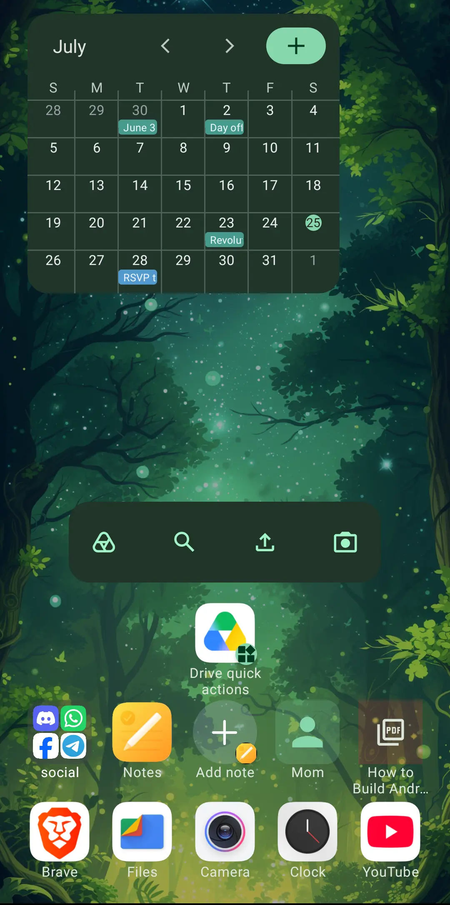

# Milki Launcher

A search-first launcher for Android. Tap the home button, type, and go. Built from scratch in **Kotlin** and **Jetpack Compose**.



## Why Milki

Milki makes everything one search away — apps, files, contacts, and the web all live behind a single search bar or pinned on homescreen.

- **The search bar does everything.** Open it with the home button, start typing. Recents show up instantly.
- **Prefix shortcuts.** Type `f` to search files on your device, `c` to find and call a contact, `yt` to search YouTube. Create your own prefixes for Wikipedia, DuckDuckGo, or anything else.
- **Pin anything to your homescreen.** Drag apps, files, contacts, or shortcuts straight from search results onto your grid.
- **Widgets that fit your layout.** Inline widgets live in the grid. Popup widgets hide behind an icon and expand on tap.
- **Gestures you control.** Map one tap, double tap, swipe up, and swipe down to any action — open an app, lock the screen, show notifications, or do nothing.
- **Smart clipboard.** Copy a link or a search query, open Milki, and it suggests the obvious next step.
- **Backup.** Milki keeps every app, folder, and widget backed up in a JSON file you can export and restore anytime.

## Privacy

Milki is private by default. No ads, no tracking, no telemetry. Your data never leaves your device.

## Install

- **F-Droid:** [Get it on F-Droid](https://f-droid.org/en/packages/com.milki.launcher/)
- **Direct APK:** [Download the latest release](https://github.com/milkilabs/launcher/releases/latest/download/app-release.apk)

## Build from source

```bash
./gradlew assembleRelease
```

## Documentation

The [website and guide](https://milkilabs.github.io/launcher/) cover the homescreen, search dialog, and settings in more detail.

## License

[GPL-3.0](LICENSE)
